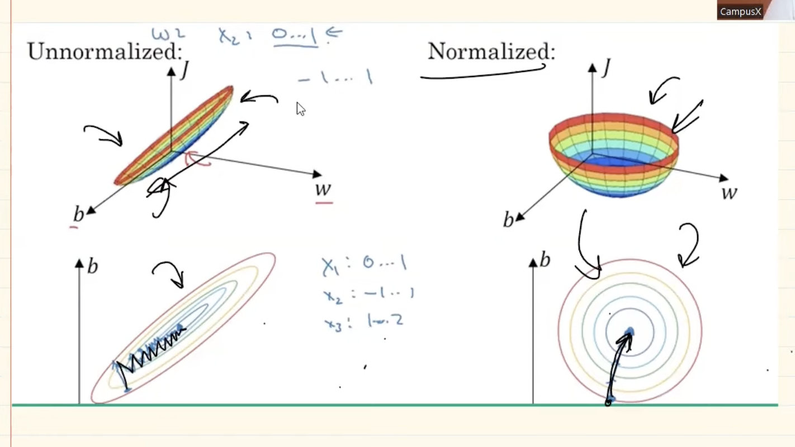

# Multi Layer Perceptron (Neural Network)

- Check out different architectures and play with neural networks on following link:
[Tensorflow Playground](https://playground.tensorflow.org/#activation=tanh&batchSize=10&dataset=circle&regDataset=reg-plane&learningRate=0.03&regularizationRate=0&noise=0&networkShape=4,2&seed=0.96653&showTestData=false&discretize=false&percTrainData=50&x=true&y=true&xTimesY=false&xSquared=false&ySquared=false&cosX=false&sinX=false&cosY=false&sinY=false&collectStats=false&problem=classification&initZero=false&hideText=false)

## Number of Parameters
The number of parameters in a neural network is determined by the architecture of the network.


    Given network contains:
        4 Layers, 2 Hidden Layers with 4 perceptron each, 1 Output Layer with 1 neuron and 1 Iutput Layer with 3 perceptron.

        - No. of parameters to be measured is calculated by multiplying the no.of input perceptrons to output perceptrons and adding biases of each output perceptron.
        For example - [(3*4)+4] + [(4*4)+4] + [(4*1)+1] = [16]+[20]+[5]= 47 neurons in total
        
        The first layer is connected to the second one by a fully-connected connection, which means that each neuron of the first layer is connected with all neurons of the second layer

## Notations

W^(layer_no)_(input_neuron_no)(output_neuron_no)

For the above network:
    W^2_14->Weight of the 1'st neuron of 2'nd layer connecting to 4'th neuron  of 3'rd layer.
    b_21-> Bias of the 2'nd layer's 1'st neuron.
    

# Loss Functions in Neural Network

Loss functions are used to evaluate how well the model performs its task. There are several loss functions available mainly:

    1.Mean Squared Error (MSE): (y'-y)^2 
        - Advantages: Easy to interpret, differentiable, 1 local minima
        - Disadvantages: Error unit (squared) -> differentiable, Not robust to outliers that is it punishes the outliers.

    2.Mean Absolute Error (MAE): |y'-y|
        - Advantages: Easy to interpret, intuitive, Robust to outliers, unit same
        - Disadvantages: Error unit (squared) -> not differentiable

    3.Huber loss: (if |y-y'|<=delta then H=(y-y')^2/2 else H=delta*|y-y'|-(delta^2)/2)
        - Works well when there more outliers in the data

    4.Binary crossentropy loss or Log loss: -[(1-y')*log(1-y')+ (y' * log y') ]
        - Used for binary classification problems
        - Activation function at the output layer should be sigmoid.

    5.Categorical Cross Entropy Loss: -(1/n)*sum(y'_i *log(y))
        - Used for multi class classification problem
        - Softmax activation function used at the output layer.
        - Neurons at the output layer should be as many as classed.
        - We need to onehotencode the data before applying this loss function else we can use Sparse Categorical cross emtropy.
        - Sparse Categorical cross emtropy is prefereed as we dont need to onehotencode and it is faster for many class dataset.
    
**NOTE**: Cost function is addition of all rows loss in the dataset whereas loss function is for only one particular row.


## Gradient Descent Algorithms

### Batch Gradient Descent
- Uses the entire dataset to compute the gradient.
- Updates model parameters once per epoch.
- More computationally expensive but converges smoothly.

### Stochastic Gradient Descent (SGD)
- Uses only one randomly chosen data point to compute the gradient.
- Updates model parameters after each data point.
- Less computationally expensive but may exhibit more oscillations during convergence.

### Mini batch gradient descent 
- Uses a small random subset (mini-batch) of the dataset to compute the gradient.
- Updates model parameters after processing each mini-batch.
- Strikes a balance between the smooth convergence of batch gradient descent and the computational efficiency of SGD.


## Vanishing and Exploding gradient problem

### Vanishing Gradient Problem
- Occurs when gradients become extremely small during backpropagation.
- Common in deep neural networks with many layers, especially those using activation functions like sigmoid or tanh.
- Leads to slow or stalled learning in early layers, hindering model convergence.
- Mitigated by using activation functions like ReLU and careful initialization of network weights.

### Exploding Gradient Problem
- Occurs when gradients become extremely large during backpropagation.
- Can cause unstable training, diverging loss, and parameter updates that oscillate wildly.
- Often observed in deep networks with very large learning rates or poorly conditioned optimization problems.
- Remedied by gradient clipping, reducing learning rates, or using techniques like batch normalization.

## Improving Neural Network 
- HyperParamterTuning:
    
    1. **Learning Rate**: Determines the step size during gradient descent.

    2. **Number of Hidden Layers and Neurons**: Impact the network's capacity to learn complex patterns.

    3. **Activation Functions**: Choices like ReLU, tanh, or sigmoid influence the network's ability to capture nonlinear relationships.

    4. **Regularization**: Techniques like L1/L2 regularization, dropout, or batch normalization prevent overfitting.

    5. **Batch Size**: Determines the number of training examples processed before updating model parameters.

    6. **Initialization Schemes**: Techniques like Xavier/Glorot initialization ensure appropriate weight initialization.

    7. **Optimizer Choice**: Algorithms like SGD, Adam, or RMSprop determine how model parameters are updated.

    8. **Learning Rate Schedule**: Techniques like learning rate decay adjust the learning rate during training.

    9. **Validation Strategy**: Determines how model performance is evaluated during hyperparameter search.

    10. **Early Stopping**: Prevents overfitting by stopping training when validation performance plateaus.

    11. **Hyperparameter Search Strategy**: Methods like grid search, random search, or Bayesian optimization explore the hyperparameter space efficiently.

    12. **Model Architecture Modifications**: Techniques like adding skip connections or using different layer types can improve performance.

- Addressing Common Challenges in Neural Networks

    1. Vanishing Gradient Problem
        - **Issue**: Gradients become extremely small during backpropagation, leading to slow learning in early layers.
        - **Solution**: Use activation functions like ReLU instead of sigmoid or tanh to mitigate vanishing gradients. Proper weight initialization and batch normalization can also help.

    2. Overfitting
        - **Issue**: Model learns to memorize training data rather than generalize, leading to poor performance on unseen data.
        - **Solution**: Employ regularization techniques like L1/L2 regularization, dropout, or early stopping. Increase dataset size or use data augmentation to provide more diverse examples.

    3. Insufficient Data
        - **Issue**: Not enough data to effectively train the model, leading to poor generalization.
        - **Solution**: Use techniques like transfer learning, where a pre-trained model on a larger dataset is fine-tuned on the target dataset. Apply data augmentation to artificially increase the dataset size. Utilize techniques like semi-supervised learning or generative adversarial networks (GANs) to generate synthetic data.

    4. Slow Training
        - **Issue**: Training the model takes too long, hindering development and experimentation.
        - **Solution**: Utilize hardware acceleration (e.g., GPUs, TPUs) to speed up training. Optimize network architecture and hyperparameters to reduce computational complexity. Implement distributed training across multiple devices or use techniques like model distillation.

- **Early Stopping in Neural Networks** - 

    Early stopping is a technique used to prevent overfitting in neural networks by monitoring the model's performance on a validation dataset during training and stopping the training process when the performance starts to degrade.

    In Keras, early stopping can be implemented using the `EarlyStopping` callback, which is part of the `keras.callbacks` module. This callback allows you to specify various parameters to control the early stopping behavior, such as the monitoring metric (e.g., validation loss or accuracy), the minimum change required to qualify as an improvement (`min_delta`), and the patience, which determines the number of epochs with no improvement after which training will be stopped.

    ```python
    from keras.callbacks import EarlyStopping
    from keras.models import Sequential
    from keras.layers import Dense

    # Define the model
    model = Sequential()
    model.add(Dense(64, activation='relu', input_shape=(10,)))
    model.add(Dense(64, activation='relu'))
    model.add(Dense(1, activation='sigmoid'))

    # Compile the model
    model.compile(optimizer='adam', loss='binary_crossentropy', metrics=['accuracy'])

    # Define early stopping criteria
    early_stopping = EarlyStopping(monitor='val_loss', patience=3)

    # Train the model with early stopping
    history = model.fit(x_train, y_train, epochs=100, validation_data=(x_val, y_val), callbacks=[early_stopping])

## Normalization

Normalization is a preprocessing technique used to scale and standardize input data, which helps improve the convergence and performance of neural networks.


### Why Normalize Data?
- **Improved Convergence**: Normalizing input features to a similar scale can help gradient descent algorithms converge faster, as it reduces the potential for large variations in the input space.
- **Stable Training**: Normalization can prevent issues like vanishing or exploding gradients by ensuring that features are within a similar range.
- **Enhanced Performance**: Normalization can lead to better generalization and performance of the model by making it less sensitive to the scale of input features.

## Dropout layer

Dropout is a regularization technique commonly used in neural networks to prevent overfitting by randomly dropping a proportion of neurons during training.


### How Dropout Works
- During each training iteration, a dropout layer randomly sets a fraction of input units to zero.
- This effectively removes those units from the network for that iteration, preventing them from contributing to the forward or backward pass.
- Dropout introduces noise into the network, which helps prevent co-adaptation of neurons and encourages the network to learn more robust features.

### Benefits of Dropout
- **Regularization**: Dropout helps prevent overfitting by reducing the network's reliance on specific neurons and encouraging the learning of more generalizable features.
- **Improved Generalization**: By forcing the network to learn redundant representations, dropout typically leads to better generalization performance on unseen data.
- **Ensemble Learning Effect**: Dropout can be seen as training multiple subnetworks within the full network, effectively creating an ensemble of models, which often leads to improved performance.

### Usage in Neural Networks
- Dropout layers are typically added after activation functions in fully connected or convolutional layers.
- The dropout rate, which specifies the proportion of units to drop, is a hyperparameter that needs to be tuned during model training.
- Dropout is generally applied during training and turned off during inference to allow the full network to make predictions without dropout noise.

### Practical Tips to apply dropout

- If Overfitting thn increase the p(dropout percent) if Underfitting then decrease it.
- First try applying it at the last layer and then if needed do it for others.
- For CNN's 40-50% gives better results and 20-30% for RNN's.
- 10-50% ANN's
- **Drawbacks**:
    - Convergence is delayed.
    - As loss function value changes gradient calculation is difficult.

- [Research Paper on Dropout](https://www.youtube.com/redirect?event=video_description&redir_token=QUFFLUhqbFRGSXRBZjVMMm1uSDdQelZnWU1YQ3J6N2RMd3xBQ3Jtc0ttdF91cDFOMzRCVi1YalNPd1U3TjBlazRvWlhlRXQ1eFVqM2xqNk4yRTBYYTZZOF9TOS1HWndWTmN0Mmc2dzNnNGxTaTlVOG9HZmY1ckg5ZHJkZGlLalBTRUtOWkNqSkFXcHVVem00WU1zbjlEdTVOUQ&q=https%3A%2F%2Fjmlr.org%2Fpapers%2Fvolume15%2Fsrivastava14a%2Fsrivastava14a.pdf&v=tgIx04ML7-Y)

### Example Usage in Keras
```python
from keras.models import Sequential
from keras.layers import Dense, Dropout

# Define the model with dropout
model = Sequential([
    Dense(64, activation='relu', input_shape=(10,)),
    Dropout(0.5),  # Dropout with 50% dropout rate
    Dense(64, activation='relu'),
    Dropout(0.5),  # Dropout with 50% dropout rate
    Dense(1, activation='sigmoid')
])

# Compile the model
model.compile(optimizer='adam', loss='binary_crossentropy', metrics=['accuracy'])
```

## Regularisation

Regularization is a technique used to prevent overfitting in machine learning models. Overfitting occurs when a model learns to fit the training data too closely, capturing noise and irrelevant patterns that do not generalize well to unseen data. Regularization methods impose constraints on the model to reduce its complexity and improve its ability to generalize. Regularization technique is any method which adds a penalty term to the loss function.

### Types of Regularization

1. L1 Regularization (Lasso): λ * ∑|w_j|
- Penalizes the absolute magnitude of the coefficients.
- Encourages sparsity by shrinking some coefficients to zero.
- Useful for feature selection and creating sparse models.


2. L2 Regularization (Ridge): λ * ∑w_j^2
- Penalizes the squared magnitude of the coefficients.
- Encourages small but non-zero coefficients.
- Helps to reduce the impact of collinearity among features.

    Where:
    - λ is the regularization parameter.
    - w_j is the j-th coefficient of the model.

3. Elastic Net Regularization
- Combination of L1 and L2 regularization.
- Allows for the benefits of both L1 and L2 regularization.
- Controls the balance between sparsity and coefficient shrinkage.

## Activation Functions

Certainly! Here's an overview of different activation functions commonly used in neural networks, along with their advantages and disadvantages:

1. **Sigmoid Function**:
   - **Advantages**:
     - Produces outputs in the range (0, 1), making it suitable for binary classification tasks where the output needs to be interpreted as probabilities.
     - Smooth gradient, facilitating stable training through backpropagation.
   - **Disadvantages**:
     - Suffers from the vanishing gradient problem, where gradients become extremely small, making training slower and more prone to convergence issues.
     - Outputs are not zero-centered, leading to slower convergence in networks with many layers.
     - Prone to saturation and gradients approaching zero for extreme inputs, causing the model to learn slowly.

2. **ReLU (Rectified Linear Unit)**:
   - **Advantages**:
     - Fast and simple computation, as it involves only a thresholding operation.
     - Overcomes the vanishing gradient problem, as it maintains a constant gradient for positive inputs.
     - Sparsity in activations, promoting sparse representations in the network and reducing computational load.
   - **Disadvantages**:
     - Not zero-centered, leading to issues with gradient-based optimization methods in networks with many layers.
     - Can suffer from the "dying ReLU" problem, where neurons become inactive and output zero for all inputs, effectively killing the gradient.

3. **Leaky ReLU**:
   - **Advantages**:
     - Addresses the "dying ReLU" problem by allowing a small gradient for negative inputs, preventing neurons from becoming inactive.
     - Helps alleviate the zero-centered activation issue.
   - **Disadvantages**:
     - Adds a hyperparameter to the model, requiring tuning.
     - May not perform significantly better than standard ReLU in all cases.

4. **Tanh Function**:
   - **Advantages**:
     - Produces outputs in the range (-1, 1), making it suitable for classification tasks where inputs have negative values.
     - Zero-centered, aiding optimization in networks with many layers.
   - **Disadvantages**:
     - Prone to the vanishing gradient problem similar to the sigmoid function, albeit to a lesser extent.
     - Computationally more expensive compared to ReLU and its variants.

5. **Softmax Function**:
   - **Advantages**:
     - Used in the output layer for multi-class classification tasks, providing probabilities for each class.
     - Ensures that the output probabilities sum up to 1, facilitating interpretation.
   - **Disadvantages**:
     - Sensitive to outliers, as it exponentiates the input values, potentially leading to numerical instability.
     - Requires careful handling during implementation to prevent issues with large or very small inputs.

Choosing the appropriate activation function depends on the specific characteristics of the problem at hand and the architecture of the neural network. Experimentation and empirical testing are often necessary to determine the most suitable activation function for a given task.

### Different types of relu
- Relu
- Leaky relu
- ELU (Exponential Linear Unit)
- SELU (Scaled Exponential Linear Unit)

## Weight initialization

### Dont's

1. Initialize weights as 0.
2. Initialize weights as same constant number.
3. Initialize weights as random weights. (too small or big)

### Do's

#### Xavier Initialization
- Used mainly in **tanh and sigmoid** activation functions.

##### Normal Distribution
For a normal distribution, the weights are initialized according to Xavier initialization as:
&radic;(1/fan_in)
    where:
        fan_in is input in a neuron.
##### Uniform Distribution
For a uniform distribution, the weights are initialized according to Xavier initialization as:
&radic;(6/(fan_in+fan_out))
    where:
        - fan_in is input in a neuron.
        - fan_out is output in a neuron.

#### He Initialization
- Used mainly in **relu** activation functions.
##### Normal Distribution
For a normal distribution, the weights are initialized according to He initialization as:
&radic;(2/fan_in)
    where:
        - fan_in is input in a neuron.

##### Uniform Distribution
For a uniform distribution, the weights are initialized according to He initialization as:
&radic;(6/fan_in)
    where:
        - fan_in is input in a neuron.
        - fan_out is output in a neuron.
