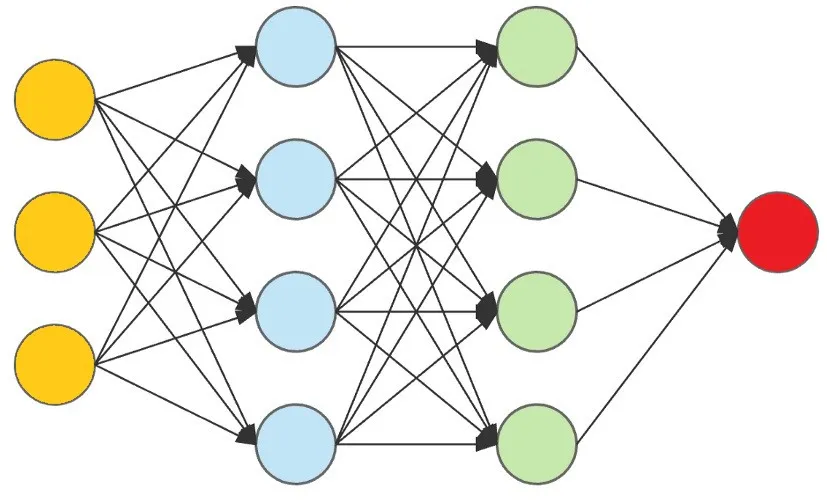

# Multi Layer Perceptron (Neural Network)

- Check out different architectures and play with neural networks on following link:
[Tensorflow Playground](https://playground.tensorflow.org/#activation=tanh&batchSize=10&dataset=circle&regDataset=reg-plane&learningRate=0.03&regularizationRate=0&noise=0&networkShape=4,2&seed=0.96653&showTestData=false&discretize=false&percTrainData=50&x=true&y=true&xTimesY=false&xSquared=false&ySquared=false&cosX=false&sinX=false&cosY=false&sinY=false&collectStats=false&problem=classification&initZero=false&hideText=false)

## Number of Parameters
The number of parameters in a neural network is determined by the architecture of the network.

    Given network contains:
        4 Layers, 2 Hidden Layers with 4 perceptron each, 1 Output Layer with 1 neuron and 1 Iutput Layer with 3 perceptron.

        - No. of parameters to be measured is calculated by multiplying the no.of input perceptrons to output perceptrons and adding biases of each output perceptron.
        For example - [(3*4)+4] + [(4*4)+4] + [(4*1)+1] = [16]+[20]+[5]= 47 neurons in total
        
        The first layer is connected to the second one by a fully-connected connection, which means that each neuron of the first layer is connected with all neurons of the second layer

## Notations

W^(layer_no)_(input_neuron_no)(output_neuron_no)

For the above network:
    W^2_14->Weight of the 1'st neuron of 2'nd layer connecting to 4'th neuron  of 3'rd layer.
    