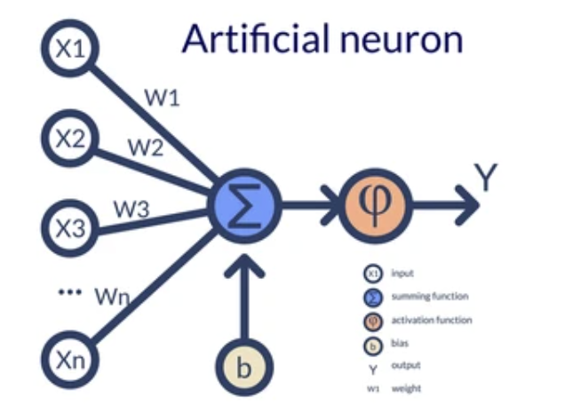

# Perceptron

A perceptron is the simplest form of a neural network, serving as a basic building block for more complex models. It's often used for binary classification tasks.



## Comparison with Neuron

- **Complexity**: A single neuron in a biological brain is highly complex, involving various biological processes. In contrast, a perceptron is a simplified mathematical model, consisting of input features, weights, and an activation function.
  
- **Processing**: Neurons in the brain process information in parallel, forming intricate networks. Perceptrons, on the other hand, process inputs sequentially, updating weights based on input signals and predefined rules.
  
- **Neuroplasticity**: Biological neurons exhibit neuroplasticity, allowing them to adapt and reorganize connections based on experience. Perceptrons lack this capability and require manual adjustments to their parameters for learning.

Weight values in a perceptron indicate the importance of features in the classification process.

## Geometric Intuition

The perceptron classifies data into two classes by creating a decision boundary, which could be a line in 2D, a plane in 3D, or a hyperplane in higher dimensions. This decision boundary separates the classes based on the features of the input data.

# Training Perceptron 

## Perceptron Trick
- We take a line and run a loop till convergence or for 1000 epoches, for each interval we select a point and check wheather the point is at correct position and update the line accordingly
    - Now to update the line for a particular point we take some learning rate like 0.01 or .01 depending on the data and multiply the coordinates and subtract this from the coef of the line (learning rate is because of the high transformation in line otherwise)

- **Algorithm** - 
```
for i in range (epochs):
    // select a random student i 
    w_n = w_0+n*(y_i-y_i_^)*x_i
```
